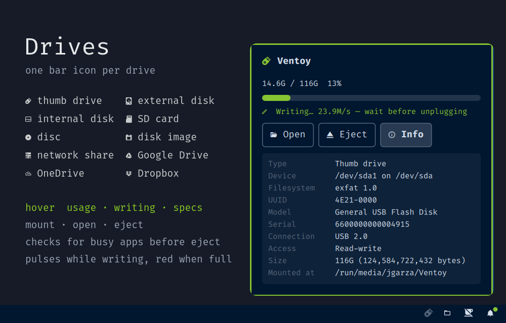

# Drives



Every drive gets its own icon on the Omarchy bar. Hover an icon to see how
full the drive is and whether it's being written to. You can open, mount or
eject it from the same card, and **Info** shows the drive's specs.

## What it does

- **One icon per drive, by type:**

  | | Type | How it's recognised |
  |---|---|---|
  | 󱊞 | Thumb drive | USB with a stick-like model name (Cruzer, DataTraveler, "Flash Disk"…), or ≤ `thumbMaxGb` |
  | 󰋊 | External disk | USB / hotplug disk bigger than `thumbMaxGb` |
  |  | Internal disk | a second internal NVMe/SATA disk (never the one holding `/`) |
  | 󰟜 | SD card | `mmcblk*` or a USB card reader |
  | 󰗮 | Disc | optical drive |
  | 󰨣 | Disk image | ISO/IMG mounted from a loop device under `/run/media`, `/media` or `/mnt` |
  | 󰒍 | Network share | NFS / SMB / sshfs / WebDAV, and GNOME (gvfs) network mounts |
  | 󰊶 | Google Drive | `rclone mount` of a `drive` remote, or GNOME Online Accounts |
  | 󰏊 | OneDrive | `rclone mount` of a `onedrive` remote, or GNOME Online Accounts |
  | 󰇣 | Dropbox | `rclone mount` of a `dropbox` remote |
  | 󰅟 | Cloud | any other rclone remote |

- **Hover card**

  ```
  󱊞 Ventoy
  14.5G / 116G  13%
  [██░░░░░░░░░░░░░░░░░░]
  󰏫 Writing… 23 MB/s — wait before unplugging
  [Open] [Eject] [Info]
  ```

  **Info** shows the device, filesystem and version, UUID, model, serial,
  connection (USB 2.0 / 3.x speed, NVMe, SATA…), LUKS state (with a **Lock**
  button), read-only / read-write, exact size and mountpoint. Encrypted drives
  get a padlock badge. Read-only mounts get a red **RO** badge.
- **Unmounted drives.** A drive that's plugged in but not mounted shows as a
  dimmed icon with a **Mount** button. Encrypted (LUKS) drives get an
  **Unlock** button instead, which opens a terminal for the passphrase.
  Partitions under 64 MB, like EFI helpers, are hidden.
- **Busy check before eject.** If a program has files open on the drive,
  eject stops and the card shows which programs (`Busy — in use by nvim
  (1234)`). You can then pick **Retry** or **Close apps & eject**, which
  sends those programs SIGTERM and then SIGKILL after 2 s.
- **Write activity.** The icon pulses while the drive is being written to,
  and the card shows the speed. Activity is tracked per partition, so the
  other partitions on the same disk don't light up.
- **Nearly full.** The icon and the usage bar turn your theme's urgent color at
  `fullWarnPct`.
- **Grouping.** With `groupAt` or more drives, the icons collapse into one
  icon with a count (`󰋊 5`). Its card lists every drive.
- **rclone sync status.** Mounts started with `--rc` show `Uploading N files…`
  or `Synced`, and the icon pulses while uploads are pending.
- **Instant hotplug.** The bar updates when a drive is plugged in or pulled
  out, using `udevadm monitor`. A timed check runs as a backup.

Clicks on the icon: **left** opens the drive (or mounts / unlocks it) ·
**right** ejects it.

## Install

```sh
omarchy plugin add https://github.com/jgarza9788/drives.git --enable
```

This clones the plugin into `~/.config/omarchy/plugins/jgarza.drives/` and adds
it to the right side of your bar. To move it, use the bar settings or edit
`~/.config/omarchy/shell.json`.

Update: `omarchy plugin update jgarza.drives`

## Remove

```sh
omarchy plugin remove jgarza.drives
```

This disables the widget and deletes its folder. Drives isn't a service and
writes no config files, so there's nothing else to clean up.

## Dependencies

All of these come with a standard Omarchy / Arch install:

- `python3`: runs the helper scripts in `bin/`
- `util-linux` (`lsblk`, `findmnt`) and `systemd` (`udevadm`): find the drives
- `udisks2` (`udisksctl`): mount, unmount, unlock, lock and power off, all
  without sudo
- `libnotify` (`notify-send`) and `xdg-utils` (`xdg-open`)

Optional:

- `fuse3` (`fusermount3`): unmounts rclone and sshfs mounts
- `glib2` (`gio`): unmounts GNOME Online Accounts and gvfs network mounts
- `rclone`: for cloud drives. Start the mount with `--rc` to see upload status.

Sync clients like `onedrive` (abraunegg), Dropbox and Insync keep a normal
folder in your home instead of mounting anything, so they don't show up. To
get an icon, mount the account with `rclone mount` instead.

## Settings

These go inline on the widget's entry in `~/.config/omarchy/shell.json`:

```json
{ "id": "jgarza.drives", "groupAt": 5, "fullWarnPct": 85 }
```

| Key | Default | Meaning |
|---|---|---|
| `pollIntervalSec` | 10 | backup refresh interval (hotplug is instant) |
| `alwaysShow` | false | show a dim disk icon when there are no drives |
| `showNetwork` | true | include network shares and cloud drives |
| `showUnmounted` | true | show plugged-in but unmounted filesystems (dimmed) |
| `minUnmountedMb` | 64 | hide unmounted partitions smaller than this |
| `fullWarnPct` | 90 | "nearly full" threshold |
| `groupAt` | 4 | collapse into one icon at this many drives (0 = never) |
| `thumbMaxGb` | 256 | USB disks up to this size count as thumb drives |
| `iconThumb` `iconExternal` `iconInternal` `iconSd` `iconOptical` `iconImage` `iconNetwork` `iconGdrive` `iconOnedrive` `iconDropbox` `iconCloud` | see table | glyph per type |

## What it runs

Like every Omarchy plugin, Drives runs unsandboxed inside the shell:

- `bin/drives-list`: reads `lsblk`, `findmnt`, `statvfs` and sysfs. It also
  runs `rclone listremotes` and queries `rclone rc` on localhost when rclone
  mounts exist. It only reads.
- `bin/drives-activity`: reads `/sys/block/*/stat` and `/proc/meminfo` once a
  second. It only reads.
- `bin/drives-action`: `udisksctl` mount / unmount / unlock / lock /
  power-off / loop-delete, `fusermount3 -u`, `gio mount -u`. Before an eject
  it reads `/proc/*/{fd,cwd,maps}` of your own processes. It kills processes
  only when you press **Close apps & eject**, and only the ones listed in the
  card.
- It never asks for root. It never writes your config files. LUKS passphrases
  are typed into `udisksctl` in a terminal and never pass through the shell.

## IPC

```sh
omarchy-shell drives refresh     # re-scan now
omarchy-shell drives list        # JSON of what the widget sees
omarchy-shell drives peek 0      # pop the first card for 4 s (screenshots)
omarchy-shell drives info 0      # toggle its Info panel
omarchy-shell drives eject 0     # eject it
```

To debug from a terminal, run `bin/drives-list --network --unmounted`,
`bin/drives-activity`, or `bin/drives-action busy --mount <path>`.

## License

MIT, see [LICENSE](LICENSE).
